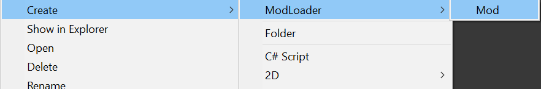
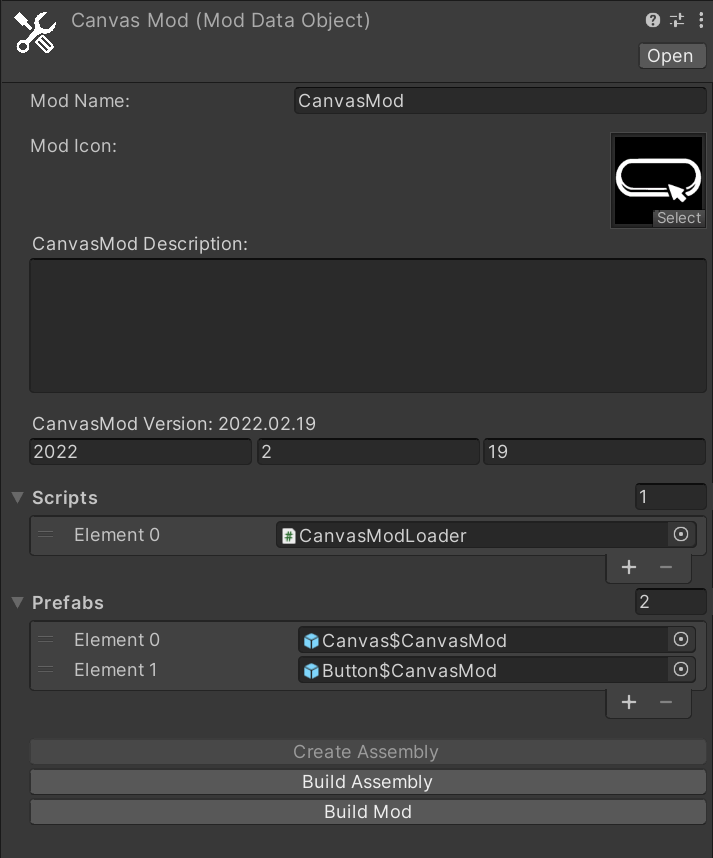

# ModsLoader

In order to make a mod that can be loaded using ModLoader, we create a folder in Unity and call it the name of our mod. Now we have the root folder of the mod.  
In the root folder of the mod, create RMB > ModLoader s> Mod.

Enter the name of the mod, description.
  

  
The mod will see the files and folders that lie next to it.
  
In the mod file, click on the "Create Assembly" button. After the Assembly is created, all mods inside the folder will be created in the mod's namespace.
  
If we want to connect TMP, then add it to the Assembly Definition Asset.
  
After you have finished making the mod, you need to export it. Select the mod and click "Build Mod".
The mod will appear in the Mods folder at the root of the project.
  
If we want to add a prefab that is not in the scenes and there are no links to it, then we put it in Prefabs in Mod.
  
If you use prefabs on the stage or spawn them via a link, then there should be no problems, but if you need to search for a prefab, then it is better to put it in the Prefabs array so that you always have access to them.
  
If you want to create a mod that runs on an interface or needs to be initialized at application startup, then such scripts should be placed in the Scripts array in the mod file.
  
At the start, an object will be created on which the specified scripts will be. In order to get a link to the mod itself, inherit your script from the ModInit script, it will contain a link to the mod object.
  
To work with mods, learn more about working with <b>AssetBunles</b>.

